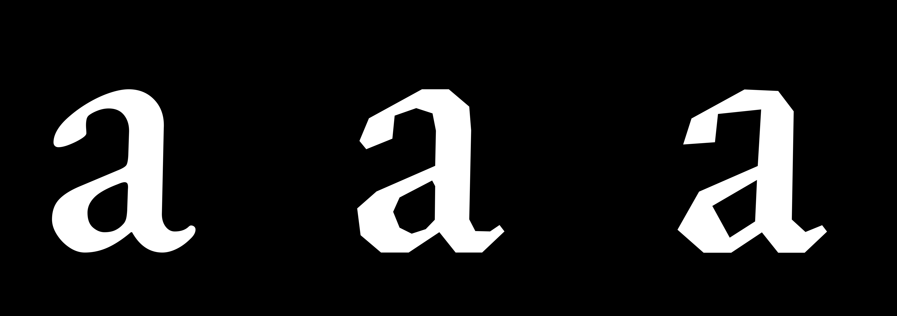

# None-Curve

An experimental web app for turning font curves into editable polygon shapes. Load a font to see its glyphs rendered live, then adjust the controls on the left and watch the outlines update on the canvas. The font editor is the primary tool; an optional audio-driven carving tool lets you shape glyphs from sound. Export only when you’re ready.

## 中文

一个将字体曲线转换成可编辑多边形的实验性网页工具。载入字体后即可看到字形的实时预览，在左侧调整控制项，画布中的轮廓会随之更新。字体编辑器是核心功能，并提供可选的声音驱动石刻工具；准备好后再手动导出作品。

形态变化参考：下图展示曲线字形向不同细节密度的多边形字形变化。

## Sound → Carving Logic → Letterform

Planned extension: map Volume, Pitch, Rhythm, Duration, Frequency distribution, and Texture to Depth, Pressure, Stroke Width, Edge Roughness, Erosion, and Chisel Angle, then generate reproducible polygon letterforms. See the [product requirements](docs/PRD.md) and [implementation plan](docs/PHASE.md).

新增规划：将声音特征转译为石刻参数，再作用于字形轮廓；支持可编辑映射、可读性约束及可复现导出。详细要求见[中文 PRD](docs/PRD.zh.md)和[中文实施计划](docs/PHASE.zh.md)。
